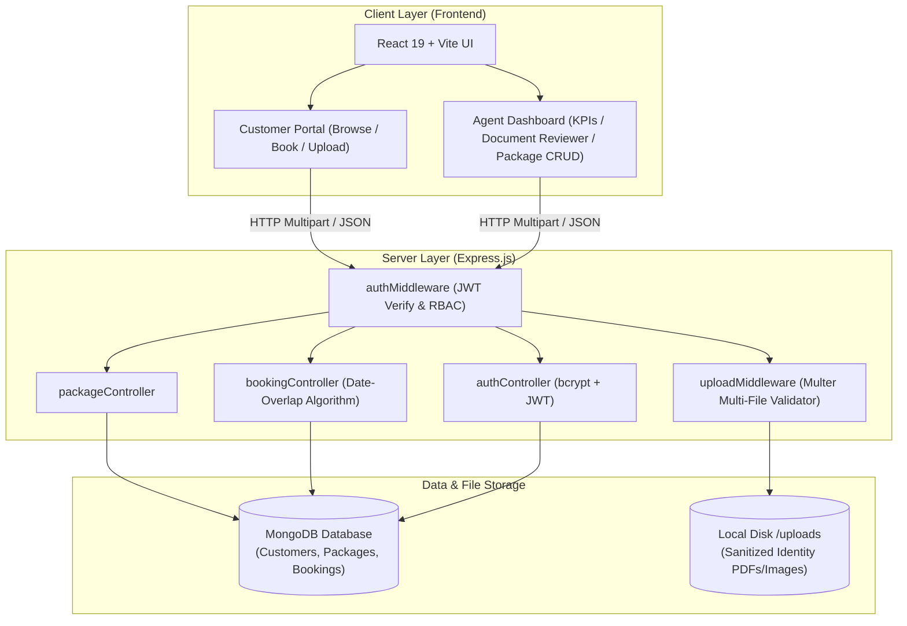

# 🌍 Travel Booking Platform (Full-Stack MERN)

[](https://nodejs.org/)
[](https://expressjs.com/)
[](https://www.mongodb.com/)
[](https://react.dev/)
[](https://vitejs.dev/)
[](https://jwt.io/)

> **B.Tech Computer Science & Engineering — Full-Stack Web Development**  
> **Case Study 125**: Production-grade Travel Booking Platform featuring Multer Multi-Document Verification, Role-Based Access Control (RBAC), and Mathematical Date-Overlap Booking Prevention.

---

## 📑 Table of Contents
- [Project Overview](#-project-overview)
- [System Architecture](#-system-architecture)
- [Key Engineering Innovations](#-key-engineering-innovations)
- [Database Schemas & Data Model](#-database-schemas--data-model)
- [Project Directory Structure](#-project-directory-structure)
- [Default Demo Credentials](#-default-demo-credentials)
- [Installation & Quick Start](#-installation--quick-start)
- [Teacher / Evaluator Presentation Guide](#-teacher--evaluator-presentation-guide)
- [REST API Reference](#-rest-api-reference)
- [Testing with Postman & Thunder Client](#-testing-with-postman--thunder-client)
- [Troubleshooting & FAQs](#-troubleshooting--faqs)

---

## 📋 Project Overview

Modern travel management requires seamless package browsing, secure identity document collection (Passport, National ID, Visa), and foolproof scheduling. This application is an end-to-end full-stack solution built to solve:
1. **Document Verification**: Secure multi-file document upload handling with type checking and storage sanitization.
2. **Double Booking Prevention**: An algorithmic MongoDB validation layer ensuring no traveler double-books the same package for overlapping dates.
3. **Role Segregation**: Enforcing strict boundaries between Customers (browse, book, view personal bookings) and Agents (manage packages, review documents, confirm/reject bookings).

---

## 🏗️ System Architecture



---

## 🛡️ Key Engineering Innovations

### 1. Mathematical Date-Overlap Prevention Algorithm
To prevent scheduling conflicts, when a customer attempts to book a trip, the backend checks for any non-cancelled bookings where:
$$\text{ExistingStartDate} \le \text{NewEndDate} \quad \text{AND} \quad \text{ExistingEndDate} \ge \text{NewStartDate}$$

**Implementation:**
```javascript
const existingOverlap = await Booking.findOne({
  customer: customerId,
  tripPackage: tripPackageId,
  status: { $ne: 'cancelled' },
  travelStartDate: { $lte: new Date(travelEndDate) },
  travelEndDate: { $gte: new Date(travelStartDate) }
});

if (existingOverlap) {
  // Removes freshly uploaded files to avoid orphaned storage
  if (req.files) {
    req.files.forEach(file => fs.unlink(file.path, () => {}));
  }
  return res.status(400).json({
    success: false,
    message: 'Overlapping booking detected! You already have an active booking for this trip package with overlapping travel dates.'
  });
}
```

### 2. Multer Multi-Document Pipeline with Rollback
- Supports multi-document uploads (`Passport`, `Visa`, `National ID`).
- Whitelists only safe MIME types: `application/pdf`, `image/jpeg`, `image/png`, `image/webp`.
- Automatically assigns collision-free filenames (`doc-timestamp-random.ext`).
- **Storage Hygiene**: If booking validation fails (e.g. date overlap or sold-out seats), uploaded files are automatically rolled back and deleted from the disk.

### 3. Role-Based Access Control (RBAC)
- **`protect`**: Decodes Bearer JWT token and attaches user object to `req.user`.
- **`authorize(...roles)`**: Restricts administrative routes to users with `role: 'agent'`.

---

## 🗄️ Database Schemas & Data Model

### 1. `Customer` Schema
| Field | Type | Attributes | Description |
| :--- | :--- | :--- | :--- |
| `name` | String | Required, Trimmed | Full name of the user |
| `email` | String | Required, Unique, Lowercase | User email address |
| `password` | String | Required, Min: 6 | Bcrypt salted hashed password |
| `role` | String | Enum: `['customer', 'agent']` | Role for RBAC (Default: `customer`) |
| `createdAt` | Date | Default: `Date.now` | Account creation timestamp |

### 2. `TripPackage` Schema
| Field | Type | Attributes | Description |
| :--- | :--- | :--- | :--- |
| `title` | String | Required, Trimmed | Package name |
| `destination` | String | Required, Indexed | Country / City location |
| `description` | String | Required | Comprehensive package details |
| `price` | Number | Required, Min: 0 | Cost per seat (USD) |
| `availableSeats`| Number | Required, Min: 0 | Capacity tracking |
| `durationDays` | Number | Required, Min: 1 | Length of trip in days |
| `itinerary` | `[String]` | Array of strings | Day-by-day plan |
| `imageUrl` | String | Default placeholder | Destination cover photo |
| `createdBy` | ObjectId | Ref: `Customer` | Agent who created package |

### 3. `Booking` Schema
| Field | Type | Attributes | Description |
| :--- | :--- | :--- | :--- |
| `tripPackage` | ObjectId | Required, Ref: `TripPackage` | Linked trip package |
| `customer` | ObjectId | Required, Ref: `Customer` | Booked customer |
| `travelStartDate` | Date | Required | Departure date |
| `travelEndDate` | Date | Required | Return date |
| `seatsBooked` | Number | Required, Min: 1 | Number of reserved seats |
| `totalPrice` | Number | Required | Calculated total cost |
| `documentPaths` | `[String]` | Array of file paths | Paths to Multer uploaded identity files |
| `status` | String | Enum: `['pending', 'confirmed', 'rejected', 'cancelled']` | Booking lifecycle status |

---

## 📂 Project Directory Structure

```text
travel-booking-platform/
├── backend/
│   ├── uploads/                      # Multer identity document storage directory
│   ├── src/
│   │   ├── config/
│   │   │   └── db.js                 # MongoDB Mongoose connection
│   │   ├── models/
│   │   │   ├── Customer.js           # Customer schema (name, email, password, role)
│   │   │   ├── TripPackage.js        # TripPackage schema (title, destination, seats, etc.)
│   │   │   └── Booking.js            # Booking schema (references, documentPaths[], dates)
│   │   ├── middleware/
│   │   │   ├── authMiddleware.js     # JWT verification (protect) & role authorization (authorize)
│   │   │   └── uploadMiddleware.js   # Multer multi-file upload configuration & validation
│   │   ├── controllers/
│   │   │   ├── authController.js     # Register, Login, GetMe
│   │   │   ├── packageController.js  # CRUD for trip packages
│   │   │   └── bookingController.js  # Bookings with Multer upload & date-overlap check
│   │   ├── routes/
│   │   │   ├── authRoutes.js         # /api/auth endpoints
│   │   │   ├── packageRoutes.js      # /api/packages endpoints
│   │   │   └── bookingRoutes.js      # /api/bookings endpoints
│   │   ├── seed.js                   # Seeder with default packages, agent, and customer
│   │   └── server.js                 # Express server & static uploads server entry point
│   ├── .env                          # Backend environment variables
│   ├── .env.example                  # Environment configuration template
│   └── package.json
│
├── frontend/                         # Vite + React Modern Web Application
│   ├── src/
│   │   ├── components/
│   │   │   ├── Navbar.jsx            # Dynamic navigation with role badge & auth triggers
│   │   │   ├── PackageCard.jsx       # Package card with destination, seats, and actions
│   │   │   ├── PackageDetailsModal.jsx # Itinerary timeline & detailed package overview
│   │   │   ├── BookingModal.jsx      # Multi-file document upload & date selection
│   │   │   ├── PackageFormModal.jsx  # Agent package creator / editor
│   │   │   ├── AgentDashboard.jsx    # Agent KPI stats, package CRUD & document reviewer
│   │   │   ├── MyBookings.jsx        # Customer bookings and document viewer
│   │   │   └── AuthModal.jsx         # Sign in/register with 1-click demo logins
│   │   ├── api.js                    # Fetch API client wrapper
│   │   ├── index.css                 # Custom CSS design system
│   │   ├── App.jsx                   # Main layout and view coordination
│   │   └── main.jsx
│   ├── vite.config.js                # Vite config with backend proxy (/api -> localhost:5001)
│   └── package.json
│
└── travel-booking-platform.postman_collection.json # Ready-to-import Postman & Thunder Client collection
```

---

## 🔑 Default Demo Credentials

| Role | Email | Password | Permissions & Capabilities |
| :--- | :--- | :--- | :--- |
| **Travel Agent** | `agent@travel.com` | `password123` | Create/Edit/Delete packages, review all customer bookings, view/download uploaded documents, confirm/reject bookings. |
| **Customer** | `customer@gmail.com` | `password123` | Browse packages, book trips, upload identity documents, view personal bookings, cancel own bookings. |

> *Tip: Both accounts can be logged in with a single click using the **"1-Click Demo Login"** buttons inside the application UI.*

---

## ⚡ Installation & Quick Start

### Prerequisites
- **Node.js**: v18 or higher
- **MongoDB**: Local MongoDB instance (`mongodb://127.0.0.1:27017/travel_booking_platform`) or MongoDB Atlas URI.

### 1. Start MongoDB
On macOS:
```bash
/opt/homebrew/bin/mongod --config /opt/homebrew/etc/mongod.conf --fork
# Or via brew:
brew services start mongodb-community
```

### 2. Setup & Start Backend
```bash
cd backend
npm install

# Seed initial packages and demo accounts:
npm run seed

# Start server:
npm start
# -> Backend runs on http://localhost:5001
```

### 3. Setup & Start Frontend
Open a new terminal window:
```bash
cd frontend
npm install

# Start development server:
npm run dev
# -> Frontend opens at http://localhost:5173
```

---

## 🎓 Teacher / Evaluator Presentation Guide

When demonstrating this project to your professor or evaluator, follow this 5-step flow:

```
[1. Public Catalog] ──> [2. Customer Login & Booking] ──> [3. Date Overlap Test] ──> [4. Agent Review & Verification] ──> [5. Postman APIs]
```

1. **Public Catalog Browsing (`/`)**:
   - Show responsive package cards with badges for price, duration, and seat availability.
   - Demonstrate the Search & Filter features.
   - Click **"View Details"** to show the day-by-day itinerary modal.

2. **Customer Booking & Multer Document Upload**:
   - Click **"Sign In"** ➔ Click **"Demo Customer"**.
   - Click **"Book Now"** on any package.
   - Select travel dates, choose seats, and attach an identity document (Passport image or PDF).
   - Submit the booking and show it appear under **"My Bookings"** with a `Pending` status.

3. **Demonstrate Date-Overlap Booking Prevention (Key USP ⭐)**:
   - Attempt to book the **same package** with **overlapping dates** for the same customer.
   - Show the prompt/error response blocking the duplicate booking.
   - Explain to the teacher: *"The backend prevents schedule collisions using MongoDB `$lte` and `$gte` range validation."*

4. **Agent Dashboard & Document Verification**:
   - Log out and log in as **"Demo Agent"**.
   - Navigate to the **Agent Dashboard**:
     - View KPI summary counters (Total Packages, Active Bookings, Pending Reviews).
     - Inspect the customer's uploaded identity document via the embedded viewer.
     - Click **"Confirm Booking"** (demonstrating status transition from `Pending` to `Confirmed`).
     - Click **"+ Add Trip Package"** to show package management.

5. **REST API & Postman Demonstration**:
   - Open Postman or Thunder Client and show the imported collection `travel-booking-platform.postman_collection.json`.
   - Run the health check endpoint (`/api/health`) and sample authenticated requests.

---

## 📡 REST API Reference

### 🔐 Authentication (`/api/auth`)
| Method | Endpoint | Access | Description |
| :--- | :--- | :--- | :--- |
| `POST` | `/api/auth/register` | Public | Register new customer or agent |
| `POST` | `/api/auth/login` | Public | Authenticate and obtain JWT token |
| `GET` | `/api/auth/me` | Private | Retrieve current user profile |

### 🏖️ Trip Packages (`/api/packages`)
| Method | Endpoint | Access | Description |
| :--- | :--- | :--- | :--- |
| `GET` | `/api/packages` | Public | Get all packages (query: `search`, `destination`, `maxPrice`) |
| `GET` | `/api/packages/:id` | Public | Get single trip package details |
| `POST` | `/api/packages` | **Agent Only** | Create a new trip package |
| `PUT` | `/api/packages/:id` | **Agent Only** | Update an existing trip package |
| `DELETE` | `/api/packages/:id` | **Agent Only** | Delete a trip package |

### 🎫 Bookings (`/api/bookings`)
| Method | Endpoint | Access | Description |
| :--- | :--- | :--- | :--- |
| `POST` | `/api/bookings` | Private | Book package with Multer document upload & overlap check |
| `GET` | `/api/bookings/my` | Private | Retrieve customer's personal bookings |
| `GET` | `/api/bookings` | **Agent Only** | Review all bookings & access customer uploaded files |
| `GET` | `/api/bookings/:id` | Private | Retrieve details of a specific booking |
| `PATCH` | `/api/bookings/:id/status` | **Agent Only** | Update status (`confirmed`, `rejected`, `cancelled`) |
| `PATCH` | `/api/bookings/:id/cancel` | Private | Cancel own booking (automatically restores package seats) |

---

## 🧪 Testing with Postman & Thunder Client

1. Open **Postman** or **Thunder Client** in VS Code.
2. Click **Import** and select:
   ```text
   travel-booking-platform.postman_collection.json
   ```
3. The collection is pre-configured with environment variables:
   - `baseUrl`: `http://localhost:5001`
   - Pre-configured login requests for both `agentToken` and `customerToken`.
   - Automated tests verifying HTTP status codes and response bodies.

---

## 🛠️ Troubleshooting & FAQs

### Q: Frontend shows `[vite] http proxy error: /api/packages ECONNREFUSED`
> **Cause**: The backend server is not running on port 5001.  
> **Solution**: Open your backend terminal, navigate to `backend/`, and run `npm start`.

### Q: MongoDB connection failed (`ECONNREFUSED 127.0.0.1:27017`)
> **Cause**: MongoDB daemon is not running on your computer.  
> **Solution**: Run `/opt/homebrew/bin/mongod --config /opt/homebrew/etc/mongod.conf --fork` or start your local MongoDB service.

### Q: Uploaded documents show broken images / 404
> **Cause**: Express static middleware is misconfigured or file path is incorrect.  
> **Solution**: Static files are served directly from `http://localhost:5001/uploads/<filename>`. Ensure `backend/uploads` directory exists.

---

## 👨‍💻 Author & Academic Attribution
- **Course**: B.Tech Computer Science and Engineering
- **Subject**: Backend Development (Node.js, Express.js & MongoDB)
- **Module**: Case Study 125 — Travel Booking Platform
- **License**: MIT
